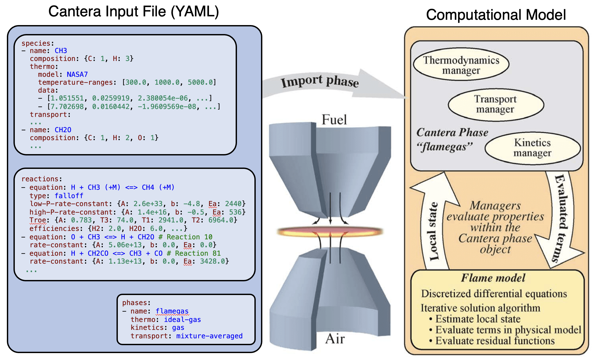
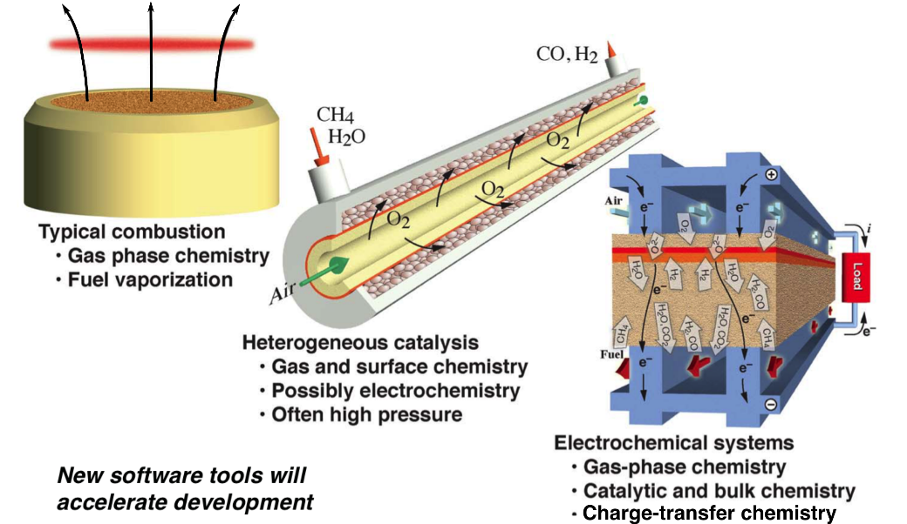

# Welcome!

## Jupyter Notebooks

The examples are available at https://github.com/Cantera/workshop-materials/tree/ncm-2025/ncm-2025

# 2025 National Combustion Meeting | Cantera Workshop
## Date: March 16th, 2025
## Organizers: Richard West & Raymond Speth

**Northeastern University**
Shillman Hall, Room 220
115 Forsyth St, Boston, MA 02115

# Agenda

| Start Time (EST) | End Time | Session                        |
|------------------|----------|--------------------------------|
| 9:00  | 12:00 | Introduction & Tutorials (including a break) |
| 12:00 | 12:30 | Lightning Talks, Part I                      |
| 12:30 | 13:30 | *Lunch break (provided)*                     |
| 13:30 | 14:30 | Lighting Talks, Part II                      |
| 14:30 | 15:00 | Contributing to Cantera (panel discussion)   |
| 15:00 | 15:30 | *Break (Tea)*                                |
| 15:30 | 18:00 | What's new in Cantera (including a break)    |

# Overview of Cantera

## Property Calculator

* Set state of your phase object(s)
* Evaluate individual properties via function calls.

## "Canonical Simulations"

* Cantera comes pre-packaged with a number of simulation tools and examples for a limited set of 'classic' problems.
  * 0-D reactors
  * 1-D flames, flows, and reactors
* These models take user inputs for intial/inlet conditions, reactor geometry, etc.
* The model sets the state of Cantera objects and evaluating properties to provide terms required to solve/integrate conservation equations.

## Property evaluation for in-house simulation code

For more complex or novel simulations, the user writes their own simulation code.
* Establishes a solution vector to describe the system state
* Defines and codes conservation equations
* Writes calls to Cantera to evaluate terms in the conservation equations

# Application Areas

Cantera can be used in a wide variety of applications
* Combustion
* Electrochemistry
* Surface chemistry
* Non-ideal equations of state

Cantera's strength is that it is (relatively) easy to add new functionality

# Installation

Installation options are provided on the website: https://cantera.org/install/

> [!TIP]
> Additional instructions are posted in the [README.md](README.md) file.

## Cantera Python API

### Conda

The easiest and recommended way (if you have Anaconda/Miniconda installed).

- [Installation instructions](https://cantera.org/stable/install/conda.html#installing-with-conda)
- **Additional Conda packages required:**
  `jupyterlab`, `matplotlib`, `pandas`, `ipympl`, `python-graphviz`, `scipy`, `jupytext`

### Pip

Using Python’s package installer, available in most Python environments.

- [Installation instructions](https://cantera.org/stable/install/pip.html#installing-with-pip)
- **Additional Pip packages required:**
  `jupyterlab`, `matplotlib`, `pandas`, `ipympl`, `graphviz`, `scipy`, `jupytext`

### Other approaches

- Ubuntu users can install the cantera-python3 package from the Cantera PPA.
- Fedora / Enterprise Linux users can install python3-cantera using dnf.
- OpenSUSE users can install packages using zypper.
- Gentoo users can install using emerge.
- FreeBSD users can install using pkg.
- If you want to use the current development version, or add features of your own, you should compile Cantera from source.

# Examples!

Examples are available from the Cantera documentation in several formats: https://cantera.org/examples/index.html
* Python examples: https://cantera.org/examples/python/index.html
* (Experimental) Matlab examples: https://cantera.org/examples/matlab/index.html
* Simple C++ examples: https://cantera.org/tutorials/cxx-guide/simple-example.html

# Community Resources

## Google Group

Link: https://groups.google.com/forum/#!forum/cantera-users
  * Email questions to the whole user group
  * The developers watch this group pretty consistently
  * New posters' messages are moderated
  * Messages asking for help with code or error messages must include
    * The code and error message in the post itself (no images!)
    * Any YAML files required to run the code
    * The OS, interface, and version of Cantera you're using

## Documentation

* Documentation at https://cantera.org/documentation
* Has examples and API documentation

## GitHub

* Cantera source code is on GitHub
* https://github.com/Cantera/cantera
* File bug reports (please be detailed and specific)
* Create pull requests to merge your new code

## Other

> [!NOTE]
> If you use Cantera for your research, please cite the project using:
>
> David G. Goodwin, Harry K. Moffat, Ingmar Schoegl, Raymond L. Speth, and Bryan W. Weber. Cantera: An object-oriented software toolkit for chemical kinetics, thermodynamics, and transport processes. https://www.cantera.org, 2024. Version 3.1.0. doi:10.5281/zenodo.14455267

* Cantera is a fiscally-sponsored project under NumFOCUS
* NumFOCUS is a non-profit umbrella organization that provides support for open-source scientific software
* We would really appreciate your support for Cantera!

