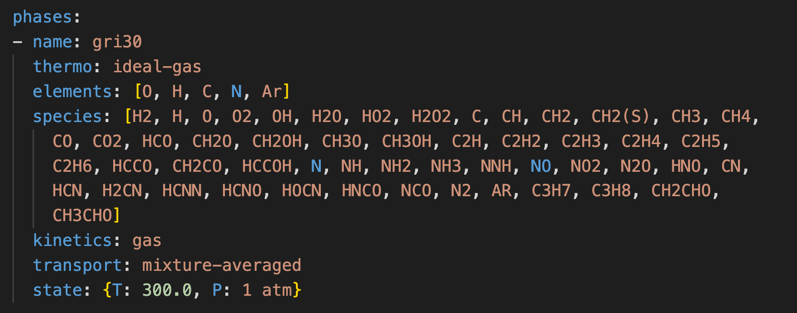
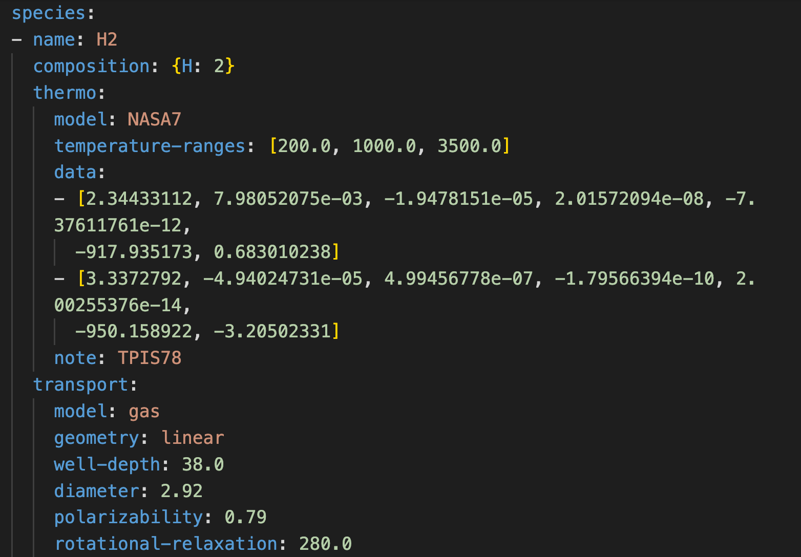
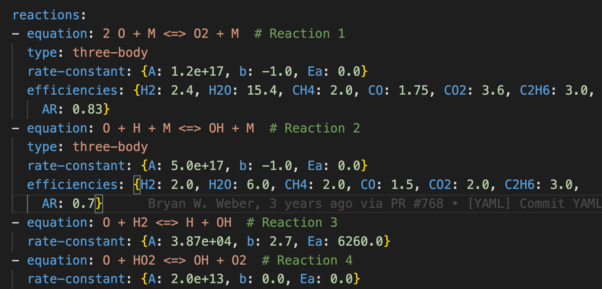

# Next Steps: Where to Find More Information

## Input Files, Scientific Theory, Phase models, Kinetics, and Website/documentation

As discussed today, much of Cantera's value is associated with it's ability to generalize chemical kinetic calculations, which can be applied to a wide range of phase models and thermo-kinetic mechanisms. Camtera also provides value by providing pre-packaged implementations of a range of "canonical" reactor simualtions.

But which phase models, kinetic reactions, and reactors can be modeled?  Where can I go to find out about Cantera's capabilities, and the scientific theory underpinning it?

We will wrap up today's workshop by providing an overview of Cantera's capabilites and highlighting how to find additional information on Cantera's website.

# Cantera Input Files

Let's take a look at the structure of a Cantera input file.

Each file must have, at a minimum, the declaration/definition for one phase, and definitions for any species contained in that phase.

We will look at Cantera's implementation of the GRI-3.0 mechanism, for reference.

# Cantera Input Files

Cantera comes with a small selection of input files, _mostly meant only for demonstration purposes._

Addtional files should be sourced by the user:
- Develop them yourself (adapted from literature or fit to data).
- Downdloaded from other sources.
- Converted from other formats (e.g. Chemkin)

This last item is perhaps most common. Cantera comes with a tool to convert Chemkin-style input files, `ck2yaml`.  You can find a short tutorial on our website:
https://cantera.org/tutorials/ck2yaml-tutorial.html

There is also a Jupyter notebook that provides practice, tips, and troubleshooting, included in the materials uyou have downloaded for today's workshop (`extras/extra_chemkin_conversion.ipynb`)

# Cantera Website Overview

Cantera's Website ([cantera.org](cantera.org)) provides the following items
- Installation instructions
- Tutorials
- Examples
- Community resources
- Science overview
- Documentation
- Blog

In this section we will focus on the Examples, Science overview, and Documentation.

# Prominent Thermodynamic Models

## Ideal Gas Model:

$$Pv = RT$$

$$u_k(T) = u^\circ_k(T)$$

$$h_k(T) = h^\circ_k(T)$$

$$s_k(T, p, X_k) = s^\circ_k(T) + R\ln\left(\frac{pX_k}{p^\circ}\right)$$

Multiple parametrization methods exist for reference properties.

## Real Gas Models:

### Redlich-Kwong

$$p = \frac{RT}{v - b} - \frac{a}{\sqrt{T}v(v - b)}$$

### Peng-Robinson

$$p = \frac{RT}{v - b} - \left[\frac{\left(a_1p+a_2\right)\alpha}{v\left(v+b\right)+b\left(v-b\right)}\right]   $$

## Ideal Interface

$$u_k(T) = u^\circ_k(T)$$
$$h_k(T) = h^\circ_k(T)$$
$$s_k(T,X_k) = s^\circ_k(T) + R\ln\left(\theta_k\right)$$

## Condensed phases

* Binary Solution, Tabulated Thermo (two-component system, fitted against data vs. composition)
* Ideal Solid Solution (ideal incompressible phase)
* Lattice Solid Phase
* Pure Fluid Phase
* Stoichiometric Substance
* Various implementations of Water EoS from literature.

# Kinetic Models

## Kinetics generally follow the Law of Mass Action

$$R_i = k_{\rm fwd}\prod_k C_{{\rm ac},\,k}^{\nu^\prime_{k,i}} - k_{\rm rev}\prod_k C_{{\rm ac},\,k}^{\nu^{\prime\prime}_{k,i}}$$

## Thermodynamic consistency enforced for reversible reactions:

$$\frac{k_{\rm fwd}}{k_{\rm rev}} = exp\left(-\frac{\Delta G^\circ_{\rm rxn}}{RT}\right)C^{\circ\,\sum \nu_k}$$

## Default parametrization for $k_{\rm fwd}$: Arrhenius:

$$k_{\rm fwd} = AT^b\exp\left(-\frac{E_a}{RT}\right)$$

# For More Information

- Cantera website science section: [https://cantera.org/science](https://cantera.org/science)
- Cantera website documentation section: [https://cantera.org/documentation](https://cantera.org/documentation)
- Cantera website examples: [https://cantera.org/examples/index.html](https://cantera.org/examples/index.html)
