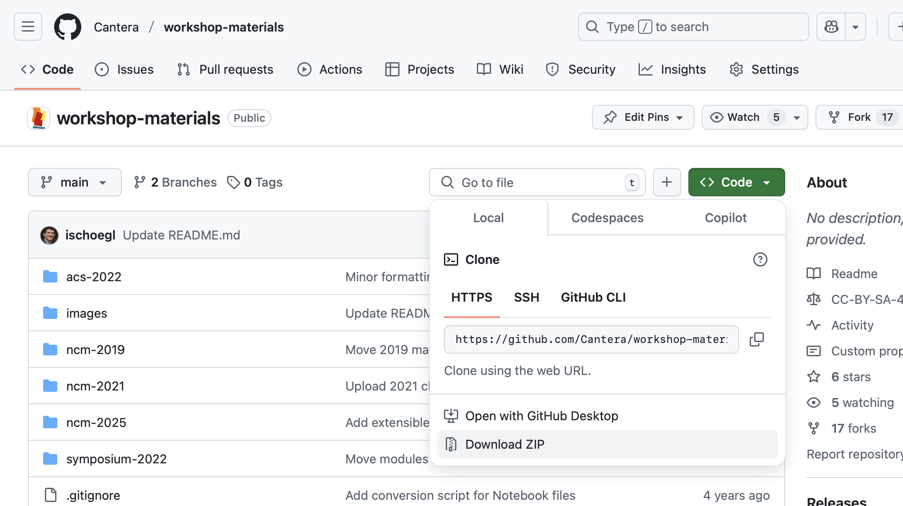

# Cantera Workshop Materials

This repository includes notebooks and other materials used at Cantera workshop associated with the 2025 NCM workshop (March 16th, Boston, MA), please make sure you have changed to the subfolder `ncm-2025` within the repository.

## Schedule

| Start Time (EST) | End Time | Session                        |
|------------------|----------|--------------------------------|
| 9:00  | 12:00 | Introduction & Tutorials (including a break) |
| 12:00 | 12:30 | Lightning Talks, Part I                      |
| 12:30 | 13:30 | *Lunch break (provided)*                     |
| 13:30 | 14:30 | Lighting Talks, Part II                      |
| 14:30 | 15:00 | Contributing to Cantera (panel discussion)   |
| 15:00 | 15:30 | *Break (Tea)*                                |
| 15:30 | 18:00 | What's new in Cantera (including a break)    |

## Overview

In this workshop, we will engage in hands-on coding tutorials and exercises using **Cantera**, an open-source suite for thermodynamics, kinetics, and transport processes. Most exercises will be conducted in **Python**, which provides the most complete and user-friendly interface for working with Cantera.

To ensure a smooth experience, please review the following requirements and setup instructions before attending.

### **📌 Workshop Requirements**
- A **laptop** with **Python and Cantera installed** (installation guide below).
- A text editor or an IDE (**Jupyter Lab** is recommended, but **VS Code, Spyder,** or **PyCharm** can also be used).
- **Basic knowledge of Python** (recommended but not required).
- An interest in **thermodynamics, chemical kinetics, and combustion modeling**!

## Installation Instructions

Installation involves four steps:
- [Install Python](#1️⃣-install-python)
- [Download Workshop Materials](#2️⃣-download-workshop-materials)
- [Install Cantera](#3️⃣-install-cantera) and Jupyter Lab
- [Launch Jupyter Notebooks](#4️⃣-launch-jupyter-notebooks)

### **1️⃣ Install Python**

If you do not have Python or Cantera installed on your computer, we recommend that you use Anaconda or Miniconda to install Python. Anaconda and Miniconda are Python distributions that include the cross-platform `conda` package manager. This provides a consistent interface to install Python packages (including Cantera) whether you're running Windows, macOS, or Linux. The difference between Anaconda and Miniconda is that Anaconda includes a few hundred of the most commonly used Python packages in the installer along with Python and `conda`, while Miniconda includes just Python and `conda`. However, all the packages included with Anaconda are available to be installed within Miniconda.

* [Anaconda installer](https://www.anaconda.com/download/)
* [Miniconda installer](https://www.anaconda.com/docs/getting-started/miniconda/install)

Make sure to download the Python 3 version of the installer! Once you've installed Anaconda or Miniconda, open a terminal (on Linux or macOS) or the Anaconda Prompt (on Windows) and type

```console
conda update -n base conda
```

If this updates your version of conda, restart your terminal so that changes to your environment can take effect.

### **2️⃣ Download Workshop Materials**

Great! Now, you need to get the materials for the workshop.

> [!TIP]
> A zipped version of all workshop files, - included all generated Jupyter notebooks, - can be [downloaded here](https://github.com/Cantera/workshop-materials/releases/tag/ncm-2025-v1).

If you want to clone the repository or download contents directly, head to <https://github.com/Cantera/workshop-materials> (you might already be reading this on that site) and find the "< > Code" button. If you have git installed on your computer, you can clone the repository. If you don't, or don't know what cloning means, don't worry! Click the green button, then click "Download ZIP", as shown in the picture below:



Once the zip file finishes downloading, unzip it and remember where the files are.

### **3️⃣ Install Cantera**

Depending on how you installed **Python** there are two options: **Anaconda/Miniconda** or starting from a generic **Python** installation.

> [!TIP]
> Detailed instructions can be found in the [Cantera documentation](https://cantera.org/stable/install)

#### I installed Python with Anaconda or Miniconda

Open your terminal (Linux or macOS) or the Anaconda Prompt (Windows) and use the `cd` command to change into the directory with the files you just cloned/unzipped. For instance, if you unzipped the files into your `Downloads` folder, then the command will look like:

```console
cd Downloads/workshop-materials/ncm-2025
```

Now you need to create a conda environment with all of the Python packages you will need.

```console
conda env create -f environment.yml
```

Finally, to run the files for the Workshop, in the same Anaconda Prompt or terminal window, activate the newly created environment by typing

```console
conda activate ct-workshop
```

#### I have a preinstalled Python version

If you installed Python from <https://python.org> or similar, you will need to follow the [operating system-specific instructions](https://cantera.org/install) for your platform to install Cantera.

Once you've got Cantera installed, you'll need to install a few other dependencies. Open a command prompt and type (`py` should be replaced by `python` on Linux or macOS):

```console
py -m pip install jupyterlab matplotlib pandas ipympl graphviz scipy jupytext
```

Open your terminal (Linux or macOS) or the Anaconda Prompt (Windows) and use the `cd` command to change into the directory with the files you just cloned/unzipped. For instance, if you unzipped the files into your `Downloads` folder, then the command will look like:

```console
cd Downloads/workshop-materials/ncm-2025
```

### **4️⃣ Launch Jupyter Notebooks**

This repository stores code in storage-efficient Jupytext format, rather than the Jupyter `.ipynb` format. Depending how you downloaded content, you may have to convert to Jupyter Notebooks, which is done by running the following command.

```Console
jupytext --to ipynb *.py
```

Finally, to run the files for the Workshop start a Jupyter Lab server by typing:

```console
jupyter lab
```

This should automatically open a page in your web browser that shows you the files for the Workshop. We're going to be working from one of the sub-folders in the zip file.

> [!NOTE]
> Alternatively, you can open Jupyter notebooks in VS Code or Spyder. For Spyder, the _spyder-notebook_ plugin is required.

Hooray! You're all set! See you on March 16th!
